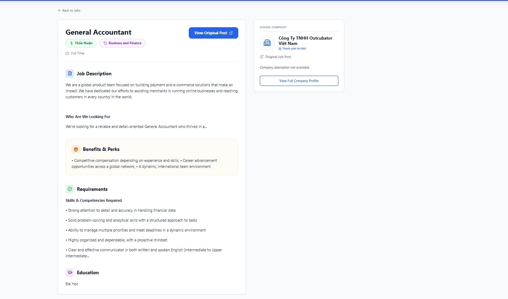
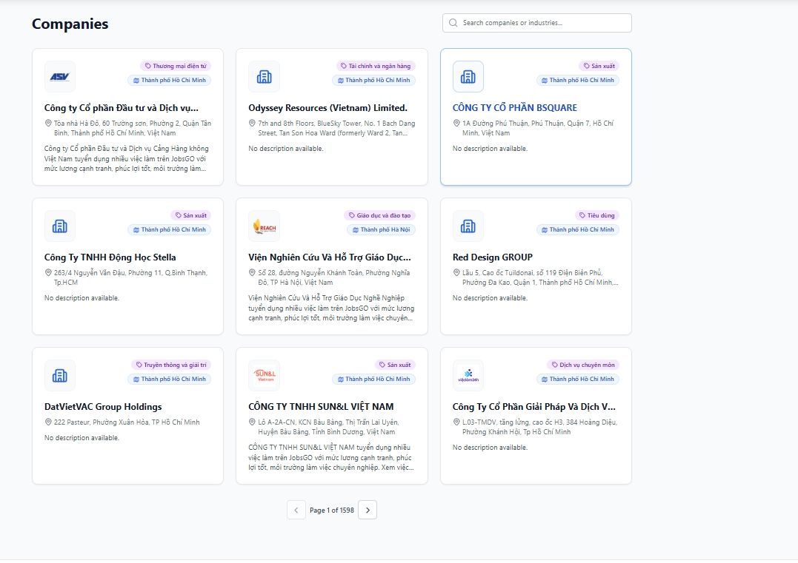
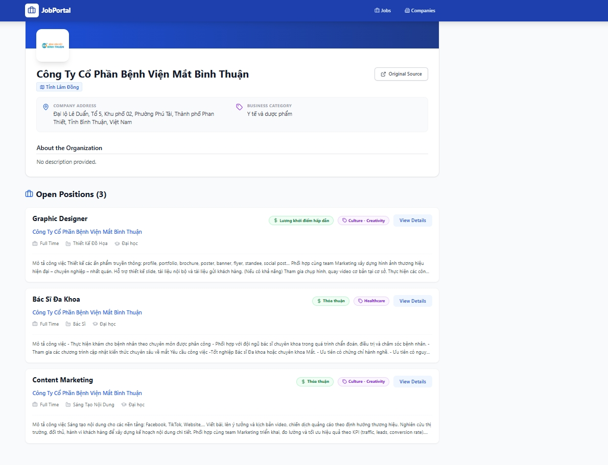

#  JobPortal: Enterprise Recruitment Architecture

JobPortal là một nền tảng tuyển dụng hiện đại được tối ưu hóa cho hiệu năng cực cao và trải nghiệm người dùng liền mạch. Dự án không chỉ đơn thuần là hiển thị dữ liệu mà còn áp dụng các kỹ thuật quản lý trạng thái, tối ưu hóa bộ nhớ đệm và xử lý dữ liệu bất đồng bộ tiên tiến.

## Visual Showcase (Giao diện Hệ thống)

Hệ thống được thiết kế với ngôn ngữ thiết kế **Modern Professional**, tập trung vào phân cấp thị giác (Visual Hierarchy).

|  1. Dashboard Tuyển dụng (Trang chủ) |  2. Chi tiết Vị trí Công việc |
|:---:|:---:|
|  |  |
| *Giao diện liệt kê thông minh với cơ chế lọc Badge.* | *Xử lý Rich Text chuyên sâu và Sidebar thông tin động.* |

|  3. Danh mục Đối tác Doanh nghiệp |  4. Hồ sơ Năng lực Công ty |
|:---:|:---:|
|  |  |
| *Grid layout tự thích ứng và công cụ tìm kiếm Real-time.* | *Tổng hợp toàn bộ vị trí đang tuyển của doanh nghiệp.* |

---

##  Phân tích Kỹ thuật Chuyên sâu (Technical Deep-Dive)

### 1. Kiến trúc Service & Data Orchestration
Trái tim của ứng dụng nằm ở `services/api.ts`, nơi áp dụng mẫu thiết kế **Singleton Pattern** để quản lý luồng dữ liệu tập trung:

*   **Cơ chế Caching Lớp 1 (Memory Cache):** 
    *   Mọi yêu cầu `GET` đều đi qua một lớp kiểm tra TTL (Time-To-Live). Nếu dữ liệu trong bộ nhớ chưa quá 5 phút, ứng dụng sẽ phản hồi ngay lập tức (~0ms latency).
    *   *Kỹ thuật:* Sử dụng `CacheEntry<T>` interface để đóng gói dữ liệu cùng timestamp.
*   **Chiến lược Parallel Fetching (Data Join):** 
    *   Thay vì đợi lấy xong danh sách công việc mới lấy tên công ty (gây hiện tượng "thác nước" chậm chạp), ứng dụng sử dụng `Promise.all` để fetch song song. 
    *   Sau đó, một thuật toán Hash Map được sử dụng để "Join" thông tin công ty vào từng tin tuyển dụng dựa trên `corporate_number` với độ phức tạp thời gian O(n).

### 2. Xử lý UI/UX & Rendering Logic
*   **Rich Text Sanitization:** Dữ liệu mô tả công việc từ các nguồn crawl thường chứa mã HTML phức tạp. Ứng dụng sử dụng một lớp trung gian để xử lý:
    *   `stripHtml`: Trích xuất text thuần túy cho phần Preview để tránh phá vỡ Layout.
    *   `dangerouslySetInnerHTML`: Được áp dụng có kiểm soát trong trang chi tiết để giữ lại định dạng danh sách, in đậm từ Backend.
*   **Dynamic Image Failover:** 
    *   Hệ thống ưu tiên Logo từ API. Nếu thiếu, ứng dụng tự động gọi đến **Clearbit Discovery API** để truy vấn Logo dựa trên domain công ty.
    *   Xử lý sự kiện `onError` trên thẻ `img` để hiển thị fallback icon (Lucide Building2), đảm bảo giao diện luôn hoàn hảo.

### 3. Responsive Design & Component Architecture
*   **Atomic Design:** Các thành phần như `JobCard`, `CompanyCard`, `Pagination` được module hóa hoàn toàn, dễ dàng bảo trì và tái sử dụng.
*   **Adaptive Layout:** Sử dụng hệ thống Grid của Tailwind CSS (`grid-cols-1 md:grid-cols-2 lg:grid-cols-3`) để tự động thay đổi số lượng cột dựa trên độ phân giải màn hình.

---

## 📡Đặc tả API & Khả năng Mở rộng

Hệ thống được thiết kế để tương thích với Backend Python/NodeJS chạy tại `port 8008`. 

**Cấu trúc dữ liệu chuẩn hóa:**
```typescript
interface Recruitment {
  media_internal_id: string; // Khóa chính duy nhất
  corporate_number: string;   // Khóa ngoại liên kết với Company
  salary_range: string;      // Xử lý dữ liệu lương linh hoạt
  industries: string;        // Hiển thị chuyên môn/ngành nghề
}
```

**Khả năng chịu lỗi (Resilience):**
- Nếu endpoint `/recruitment` trả về lỗi 404/405 (do chưa kịp triển khai ở Backend), ứng dụng sẽ không bị sập mà hiển thị một **Empty State Guide**, hướng dẫn lập trình viên Backend cách viết code để fix lỗi ngay trên giao diện.

---

##  Quy trình Cài đặt & Phát triển

1. **Khởi chạy API nếu dữ liệu đã được chuẩn bị**
 ```bash
   uvicorn api_test:app --host 0.0.0.0 --port 8008 --reload
   ```
3. **Cài đặt:**
   ```bash
   npm install
   ```
4. **Môi trường:** Đảm bảo Backend API đã bật chế độ `Allow CORS` cho origin của ứng dụng.
5. **Khởi chạy:**
   ```bash
   npm run dev
   ```

---
> **Ghi chú chuyên môn:** Dự án áp dụng triệt để nguyên lý **Don't Repeat Yourself (DRY)** và **Separation of Concerns (SoC)**, tách biệt hoàn toàn logic gọi API, logic xử lý dữ liệu và logic hiển thị giao diện.

*Dự án cá nhân bổ trợ cho hệ thông thu thập dữ liệu https://github.com/hai-pham-theinfitech/DATN*
